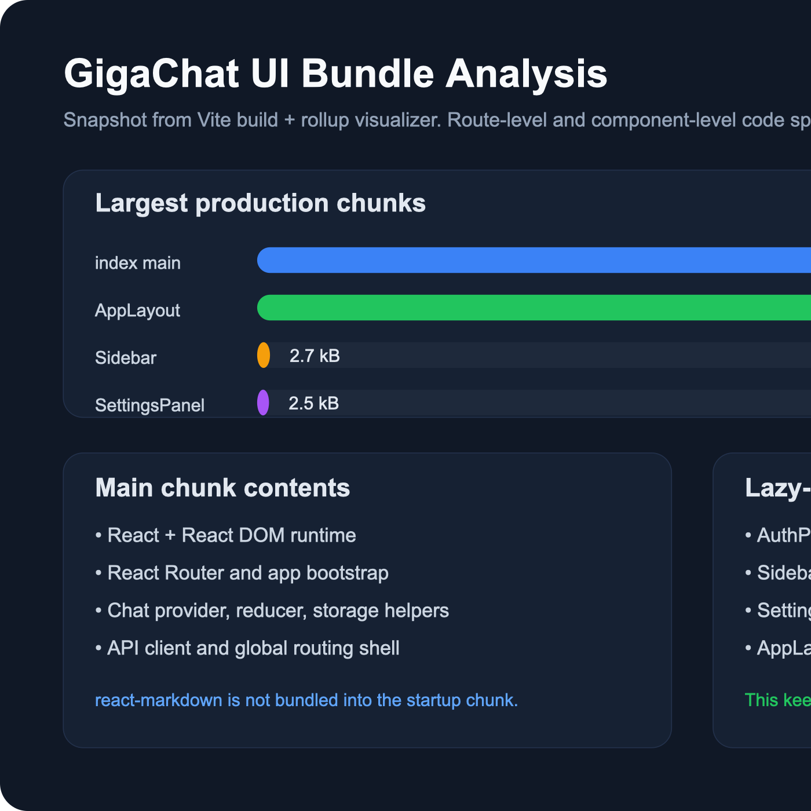

# GigaChat UI

Интерфейс чата в стиле ChatGPT на `React + TypeScript + Vite` с роутингом, историей чатов, localStorage-персистентностью, тестами и backend proxy для GigaChat API.

## Демо

- Публичное приложение: `будет добавлено после завершения деплоя`
- Bundle analysis: [docs/bundle-analysis.html](./docs/bundle-analysis.html)
- Скриншот анализа бандла:



## Стек

| Технология | Версия |
| --- | --- |
| React | `18.3.1` |
| React DOM | `18.3.1` |
| TypeScript | `5.8.0` |
| Vite | `7.x` |
| React Router DOM | `7.14.2` |
| React Markdown | `10.1.0` |
| Express | `5.2.1` |
| Vitest | `4.1.5` |
| React Testing Library | `16.3.2` |

## Что умеет приложение

- авторизация через GigaChat OAuth;
- чат с отправкой сообщений и ответами ассистента;
- streaming с fallback на обычный REST-ответ;
- markdown-рендеринг ответов;
- история чатов, поиск, rename/delete;
- сохранение состояния в `localStorage`;
- lazy loading для роутов, `Sidebar`, `SettingsPanel`;
- `ErrorBoundary` вокруг области сообщений;
- unit- и component-тесты на reducer, storage и ключевые UI-компоненты.

## Запуск локально

1. Клонировать репозиторий:

```bash
git clone git@github.com:mda031094/giga-chat-ui.git
cd giga-chat-ui
```

2. Установить зависимости:

```bash
npm install
```

3. Создать `.env` на основе шаблона:

```bash
cp .env.example .env
```

4. Запустить backend proxy:

```bash
npm run dev:server
```

5. В отдельном терминале запустить frontend:

```bash
npm run dev
```

6. Открыть приложение:

```text
http://127.0.0.1:5173/
```

Если порт `5173` занят, Vite автоматически предложит следующий свободный порт.

## Переменные окружения

| Переменная | Где используется | Назначение |
| --- | --- | --- |
| `VITE_BACKEND_API_BASE` | frontend | Базовый URL backend proxy. По умолчанию `/api`. |
| `VITE_USE_SERVER_AUTH` | frontend | Если `true`, форма входа использует серверный `Authorization Key`, а не ручной ввод. |
| `VITE_GIGACHAT_SCOPE` | frontend | Scope по умолчанию для формы входа. |
| `GIGACHAT_AUTH_KEY` | backend / serverless | Серверный `Authorization Key` для демо-режима без ручного ввода credentials. |
| `GIGACHAT_SCOPE` | backend / serverless | Scope для OAuth-запроса на сервере. |
| `GIGACHAT_OAUTH_URL` | backend / serverless | OAuth endpoint GigaChat. |
| `GIGACHAT_API_BASE_URL` | backend / serverless | Базовый URL REST API GigaChat. |
| `GIGACHAT_INSECURE_TLS` | backend / serverless | Локальный dev-fix для TLS-цепочки. В production должен быть `false`. |

## Локальный сценарий авторизации

Есть два режима:

1. Ручной вход:
   оставить `VITE_USE_SERVER_AUTH=false` и вставлять `Authorization Key` в форму.
2. Серверный демо-режим:
   выставить `VITE_USE_SERVER_AUTH=true` и задать `GIGACHAT_AUTH_KEY` на backend/хостинге.

## Тесты

```bash
npm test
```

Покрыто:

- `chatReducer`;
- `InputArea`;
- `Message`;
- `Sidebar`;
- `storage` и работа с `localStorage`.

## Анализ бандла

Команда:

```bash
npm run build:analyze
```

Результат:

- HTML-отчет: [docs/bundle-analysis.html](./docs/bundle-analysis.html)
- PNG-артефакт: [docs/bundle-analysis.png](./docs/bundle-analysis.png)

По результатам анализа:

- стартовый чанк `index` содержит в основном React, React DOM, React Router и bootstrap приложения;
- `react-markdown` вынесен из стартового чанка и попадает в `AppLayout`-ветку;
- `Sidebar`, `SettingsPanel` и route pages загружаются отдельными чанками.

## Продакшн-деплой

Проект подготовлен к деплою на Vercel:

- добавлен [vercel.json](./vercel.json) для корректной работы маршрута `/chat/:id`;
- backend proxy вынесен в serverless endpoints внутри `api/`;
- секреты не хранятся в клиентском коде и могут быть переданы через env-переменные хостинга.
